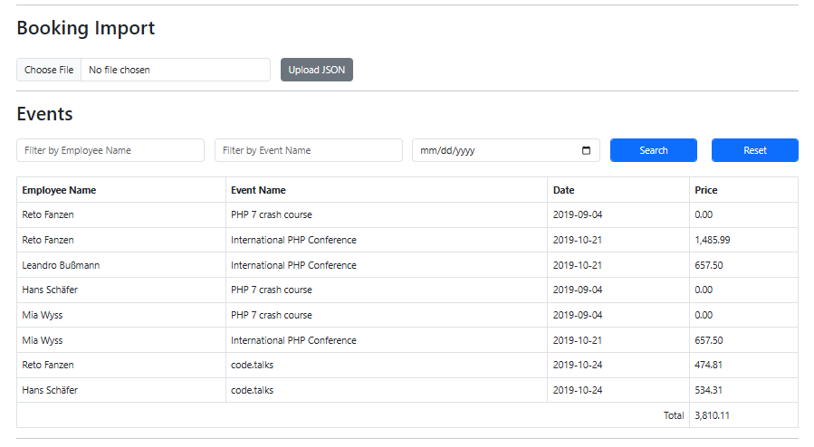

# Event Booking System
    Event Booking System

## Features
- Design a database scheme for optimized storage
- Please note that over time, large amounts of data will accumulate
- Read the json data and save it to the database using php
- Create a simple page with filters for the employee name, event name and date
- Output the filtered results in a table below the filters
- Add a last row for the total price of all filtered entries

---

### 1. Clone the Repository
```bash
git clone https://github.com/MuhammadShareyar/event-booking-system.git
cd event-booking-system
```

### 2. Create the Environment File
Create a .env file by copying .env.example
```bash
cp .env.example .env 

and add credentials in the .env file.
```


### 3. Run Composer command and access application
```bash
composer install
```

## Flow

- Import Booking
- Upload a valid JSON file containing booking data.
- Use the filters to search by:
  - Employee name ,Event name and Booking date
- View the filtered results.

Sample:
- When there is no records.

- With records

- Filter by Event name: code.	
